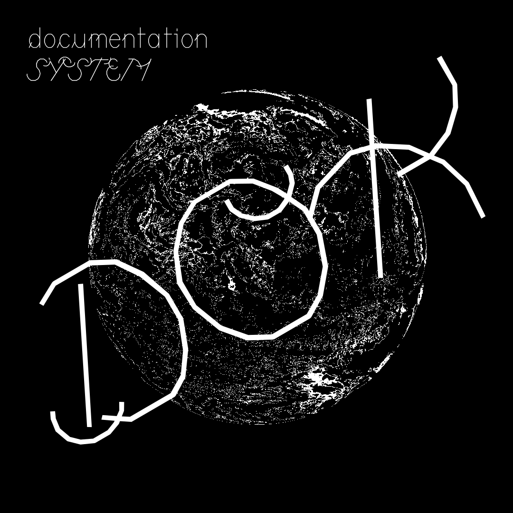

# Dok

Dok is a documentation tool/system that helps you to document (almost) everything. It can be seen as a personal assistant, it invites you to write, organize and then publish your personal knowledge online.



## Status

Dok is currently in full development. Things will be broken, then repaired, then broken again.

To use it is to accept its experimental phase.

## Installation

### Project structure

Clone this repository into your project folder. In addition to this repository, you will have a content folder, where you will have your own folders, markdown files, media files, etc. and an automatically generated public folder.

```
my-dok                      # your project folder
├── dok                     # this repository (inside your project folder)
│   ├── requirements.txt    # python dependencies
│   ├── script.py           # dok script
│   └── settings.yml        # default settings
│   └── assets              # default CSS
│   └── templates           # default templates
│   └── ...
├── content                 # your content
│   ├── 2021-01-01-about    # an article folder         
│       ├── _index.md       # an article content file
│   └── ...
├── assets                  # your own assets that overwrite the main ones
│   ├── css
│       ├── style.scss      # your own scss styles
├── public                  # public files, automatically generated             
└── ...
```

### Python and PIP

Dok requires [Python](https://en.wikipedia.org/wiki/Python_(programming_language)). You can download it from the [official Python website](https://www.python.org/downloads/), for Linux, Mac OS X or Windows.

PIP, the package manager for Python, is also required to run Dok. The Python installer installs `pip`, so it should be ready for you to use. You can verify that `pip` is available by running the following command in your console: `$ pip --version`. It should give you information about the current pip version, if it is correctly installed.

### Dependencies

In order to install the dependencies, open a terminal and make sure you are inside the `dok` folder:

```
$ cd my_project/dok
```
And run:
```
$ pip install -r requirements.txt
```

## Quickstart

### Create a project

Create a new folder somewhere on your computer, let's say in a 'repo' folder where you have all your git repositories:

```
$ cd repo
$ mkdir my-dok
$ cd my-dok
```

Once you have created your main folder, `git clone` this repository into it.

```
$ git clone git@github.com:antoinestudio/dok.git
```

### Create an article


Create a new folder in the `content` folder. Note that if this is your first article, you may need to create the content folder.

The name of a folder is composed of two elements: `creation_date-article_slug`. A slug is a short name given to an article that will be used to identify it, and later to create its URL.

Inside this folder, create a file named `_index.md` in which you will write your article.

For example: `2021-03-01-about`, where `2021-03-01` is today's date and `about` is the slug of my article.


### Generate your site

From the main project folder:

```
$ python dok/script.py
```

### Preview your site

Open your web browser and visit the path provided by the script when you run it. Under Linux, this looks like: `file:///home/antoine/repo/my-project/public/index.html`.

## Write
### Metadata
### Markdown
### Images
### Videos
### Extras

## Organize
### Folders
### Links
### Bookmarks
### Images feed

## Publish
### Gitlab
### Github

## Command-line interface
### Create a shortcut
### Options

